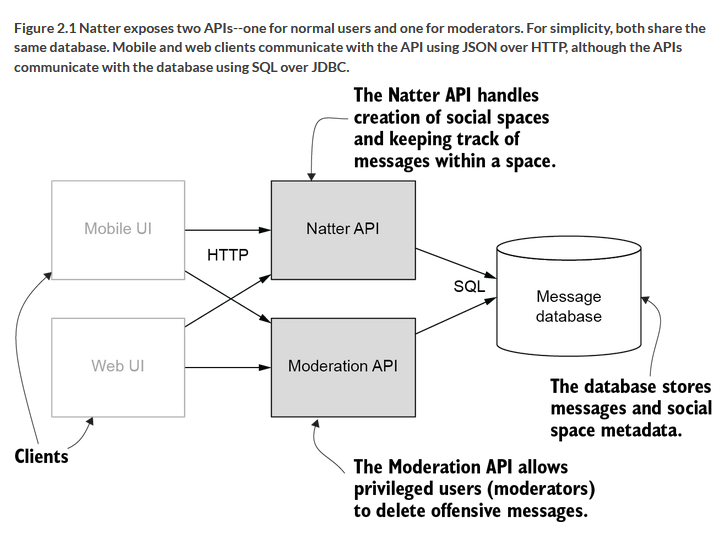

## Overview
Implementation of Natter API exercises from Neil Madden's excellent *API Security in Action* book [1].

Git tag each chapter exercise to make it easier to jump to a particular point in time. This seems to be more useful in anticipation of how I may reference this material in the future (vs. tagging the chapter beginning and end, as the author does for the reference implementation [2]), but we will see.

## Architecture Diagram

## References
1. "API Security in Action". Madden, Neil. Manning, Dec 8 2020.
2. https://github.com/NeilMadden/apisecurityinaction
